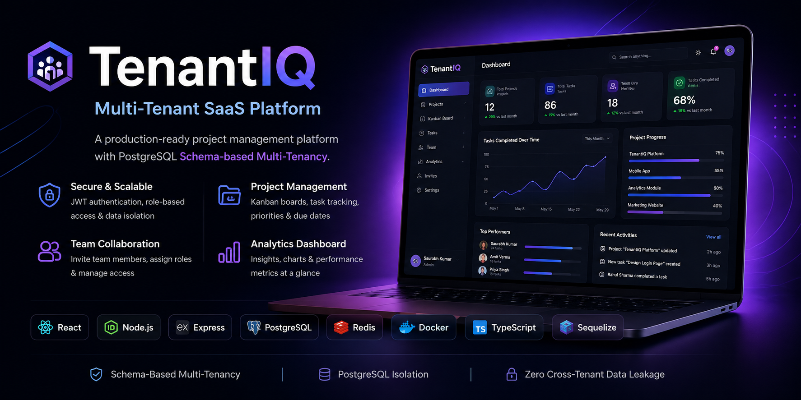
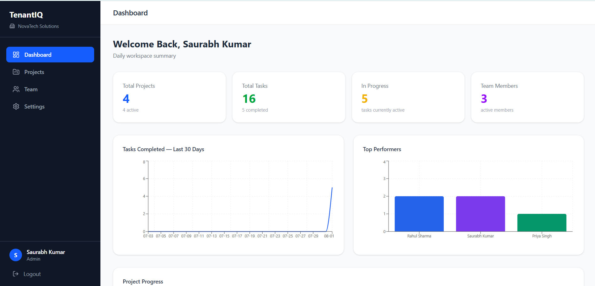
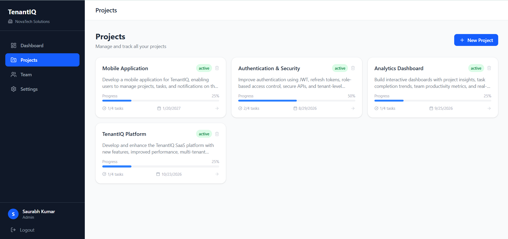
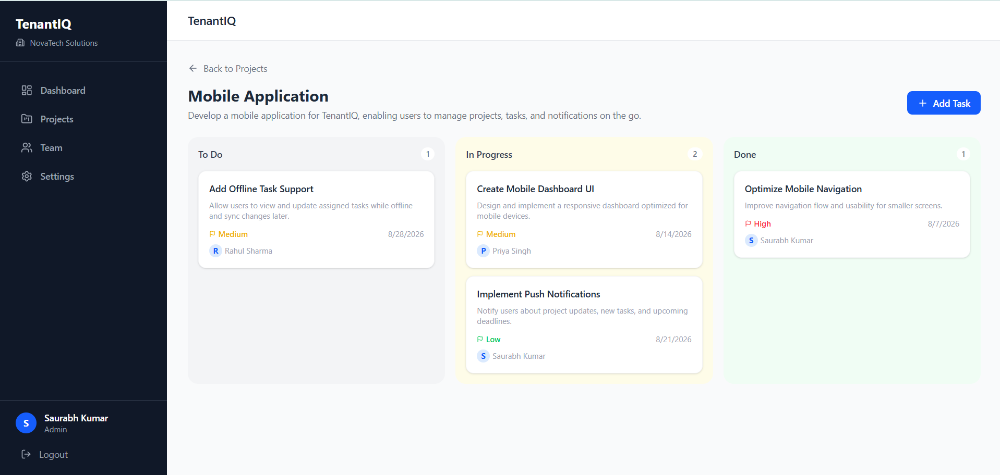
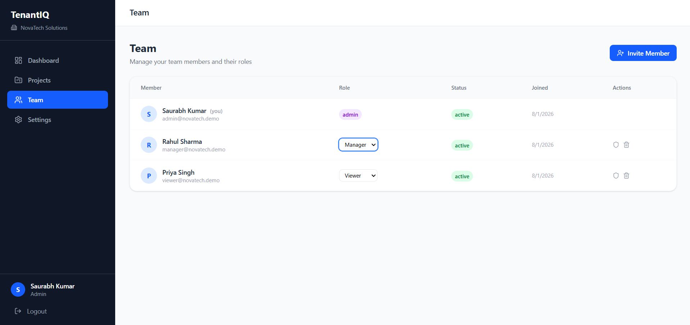

# 🚀 TenantIQ — Multi-Tenant SaaS Platform

<p align="center">



</p>

<p align="center">


</p>

A **production-ready multi-tenant SaaS project management platform** built with **React, Node.js, PostgreSQL, Redis, Docker, and TypeScript**.

Each organization receives its own PostgreSQL schema, providing complete database-level isolation while sharing the same application instance. TenantIQ includes secure authentication, team collaboration, Kanban project management, analytics dashboards, and role-based access control.

---

# 🌐 Live Demo

| Service | URL |
|---------|-----|
| **Frontend** | https://tenantiq-frontend.vercel.app |
| **Backend API** | https://tenantiq-backend.onrender.com |

> ⚠️ **Note:** Backend is hosted on Render's free tier. The first request may take around **30–50 seconds** while the server wakes up.

---

# 🔑 Demo Account

You can either register your own company or use the demo account.

| Email | Password |
|-------|----------|
| demo@novatech.com | Demo@123 |

> Every newly registered company automatically receives its own PostgreSQL schema.

---

# ✨ Features

## 🔐 Authentication

- Company Registration
- Automatic PostgreSQL Schema Creation
- JWT Authentication
- Refresh Token Authentication
- Secure httpOnly Cookies
- Role-Based Authorization

---

## 👥 Team Management

- Invite Members
- Role Assignment
- Accept Invitation Flow
- Remove Members
- Organization Management

---

## 📁 Project Management

- Create Projects
- Update/Delete Projects
- Drag & Drop Kanban Board
- Task Assignment
- Task Priorities
- Task Status Management

---

## 📊 Analytics Dashboard

- Dashboard Overview
- Project Statistics
- Task Completion Trends
- Top Performers
- Progress Charts

---

## 🏢 Multi-Tenancy

- PostgreSQL Schema Per Tenant
- Automatic Schema Creation
- Complete Database Isolation
- Shared Public Schema
- Zero Cross-Tenant Data Leakage

---

# 🏗 System Architecture

```text
                 React + TypeScript
                        │
                        ▼
                Express REST API
                        │
        ┌───────────────┼────────────────┐
        ▼               ▼                ▼
 PostgreSQL           Redis          JWT Auth
(Schema per         Cache Layer      Cookies
 Tenant)

           Docker Compose Environment
```

---

# 🛠 Tech Stack

## Frontend

- React 18
- TypeScript
- Vite
- Tailwind CSS
- React Query
- Zustand
- React Router v6
- Axios
- Recharts
- @hello-pangea/dnd

---

## Backend

- Node.js
- Express.js
- PostgreSQL
- Sequelize ORM
- Redis
- JWT
- bcryptjs
- express-validator
- cookie-parser

---

## DevOps & Infrastructure

- Docker
- Docker Compose
- GitHub Actions
- Vercel
- Render
- Supabase

---

# 📸 Application Screenshots

## Dashboard



---

## Projects



---

## Kanban Board



---

## Team Management



---

## Analytics


---

# 🗄 Multi-Tenant Database Design

```text
TenantIQ Database

public
│
├── tenants
└── users

tenant_novatech
│
├── users
├── projects
├── tasks
├── invites
└── project_members

tenant_company_b
│
├── users
├── projects
├── tasks
├── invites
└── project_members
```

Each organization receives its own isolated schema, ensuring complete separation of data while sharing the same PostgreSQL database instance.

---

# 📂 Project Structure

```text
TenantIQ
│
├── tenantiq-frontend
│   ├── src
│   ├── public
│   ├── Dockerfile
│   └── package.json
│
├── tenantiq-backend
│   ├── src
│   ├── Dockerfile
│   ├── package.json
│   └── .env.example
│
├── docker-compose.yml
│
└── README.md
```

---

# 🚀 Running Locally

## Using Docker (Recommended)

```bash
git clone https://github.com/krsaurabh007/TenantIQ.git

cd TenantIQ

docker compose up --build
```

Application URLs

Frontend

```
http://localhost:5173
```

Backend

```
http://localhost:5000
```

---

## Manual Setup

### Backend

```bash
cd tenantiq-backend

npm install

cp .env.example .env

npm run dev
```

---

### Frontend

```bash
cd tenantiq-frontend

npm install

npm run dev
```

---

# 💡 Key Highlights

- Production-ready Architecture
- PostgreSQL Schema-Based Multi-Tenancy
- Dockerized Development
- Redis Caching
- JWT Authentication
- Role-Based Access Control
- Responsive UI
- Drag & Drop Kanban
- Analytics Dashboard
- Secure Refresh Token Authentication

---

# 🗺 Roadmap

- Email Notifications
- File Attachments
- Activity Timeline
- WebSocket Real-time Updates
- Audit Logs
- Kubernetes Deployment
- AWS Deployment
- Performance Monitoring

---

# 👨‍💻 Author

**Saurabh Kumar**

Software Developer @ Appsndevices Technologies Pvt. Ltd.

📧 Email  
saurabhkumar4040@gmail.com

💼 LinkedIn  
https://linkedin.com/in/saurabh-kumar-99009b24a

🐙 GitHub  
https://github.com/krsaurabh007

---

⭐ If you found this project useful, consider giving it a **Star**.
