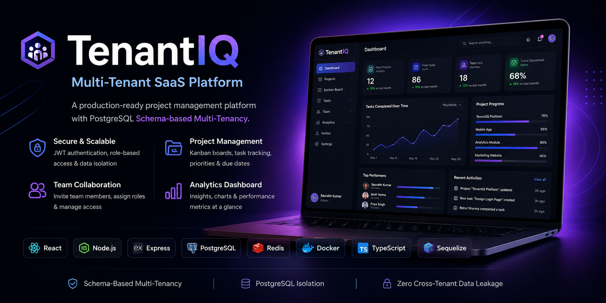
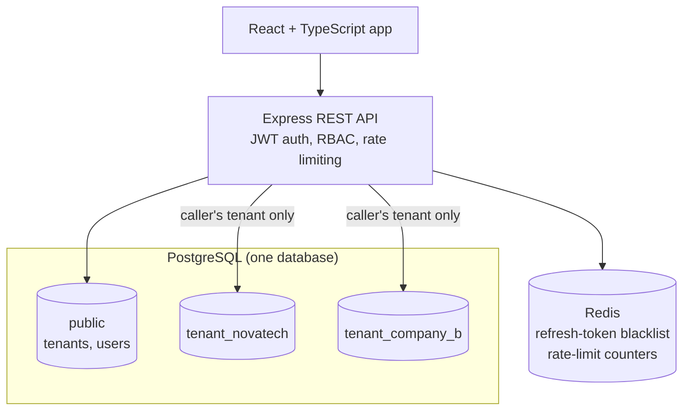
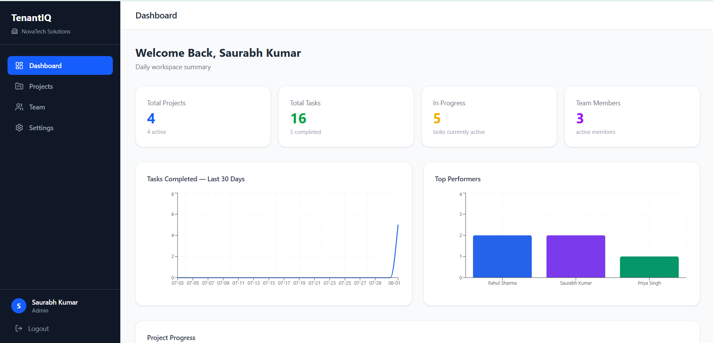
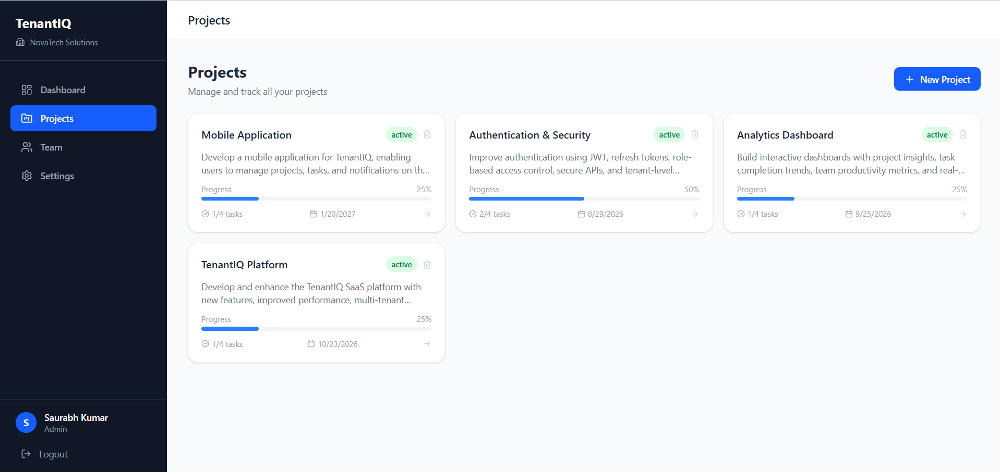
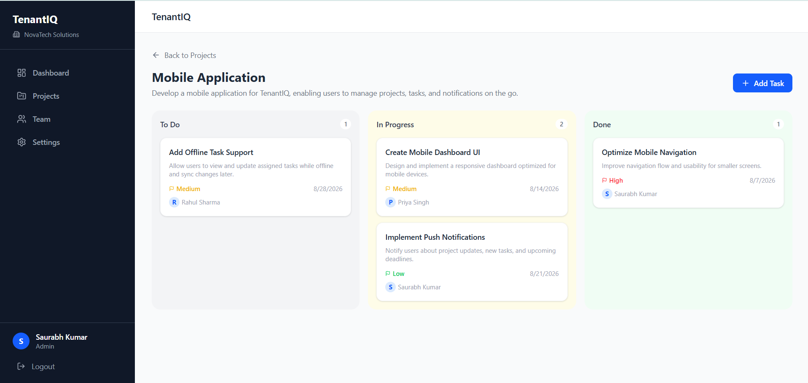
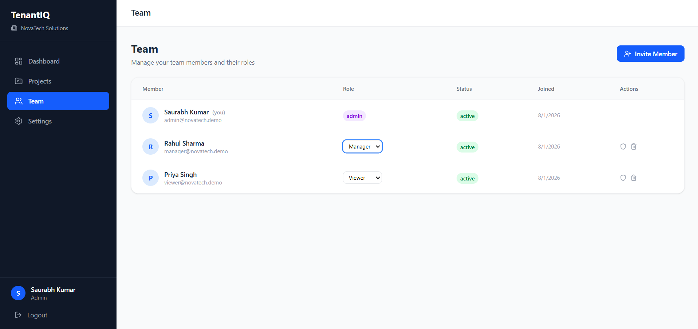

<h1 align="center">TenantIQ</h1>

<p align="center"><b>Multi-tenant SaaS project management platform with a separate PostgreSQL schema for every organization.</b></p>

<p align="center">
  
</p>

<p align="center">
  
  
  
  
  
  
  
</p>

Every company that registers gets its own PostgreSQL schema, so tenant data is separated at the database level while all tenants share one application instance. On top of that sit secure authentication, team invitations, a drag-and-drop Kanban board, role-based access control and an analytics dashboard.

## Live demo

| | |
|---|---|
| **Frontend** | https://tenantiq-frontend.vercel.app |
| **Backend API** | https://tenantiq-backend.onrender.com |

> The backend runs on Render's free tier, so the first request can take 30 to 50 seconds while the server wakes up.

**Try it:** register your own company, or sign in with the demo account.

| Email | Password |
|---|---|
| `demo@novatech.com` | `Demo@123` |

## What makes it interesting

- **Schema-per-tenant isolation.** Registering a company creates a new PostgreSQL schema automatically. Tenant data lives in its own schema, so separation is enforced by the database and not only by `WHERE` clauses in application code.
- **Careful session security.** Short-lived JWT access tokens plus refresh tokens stored in `httpOnly` cookies, so JavaScript in the browser cannot read them.
- **Real logout and session invalidation.** Refresh tokens are blacklisted in Redis, so a stolen or logged-out token stops working.
- **Brute-force protection.** Redis-backed rate limiting on authentication routes.
- **Role-based access control.** Admin, Manager and Viewer roles enforced on the backend and reflected in the UI.
- **Reproducible environment.** The whole stack (backend, PostgreSQL, Redis) starts with one `docker compose up`, with health checks, and ships through a GitHub Actions CI/CD pipeline.

## Features

| Area | What you can do |
|---|---|
| **Authentication** | Company registration, login, refresh-token rotation, secure cookies |
| **Team** | Invite members, assign roles, accept invitations, remove members |
| **Projects** | Create, update and delete projects, assign tasks, set priority and status |
| **Kanban** | Drag and drop tasks between columns |
| **Analytics** | Dashboard overview, project statistics, task completion trends, top performers, progress charts |

## Architecture


```mermaid
flowchart TD
    U["React + TypeScript app"] --> API["Express REST API<br/>JWT auth, RBAC, rate limiting"]
    API --> R[("Redis<br/>refresh-token blacklist<br/>rate-limit counters")]
    subgraph PG["PostgreSQL (one database)"]
        PUB[("public<br/>tenants, users")]
        T1[("tenant_novatech")]
        T2[("tenant_company_b")]
    end
    API --> PUB
    API -->|"caller's tenant only"| T1
    API -->|"caller's tenant only"| T2
```

### Database layout

```text
public
├── tenants
└── users

tenant_novatech
├── users
├── projects
├── tasks
├── invites
└── project_members

tenant_company_b
├── users
├── projects
├── tasks
├── invites
└── project_members
```

### Why a schema per tenant

| Approach | Isolation | Cost and effort | Main drawback |
|---|---|---|---|
| Shared tables with a `tenant_id` column | Depends on every query filtering correctly | Lowest | One missed filter leaks data |
| **Schema per tenant (this project)** | Enforced by the database | Medium | Migrations must run for every schema |
| Database per tenant | Strongest | Highest | Many databases to run and back up |

Schema-per-tenant gives strong isolation without running a separate database for every customer.

## Tech stack

| Layer | Technologies |
|---|---|
| **Frontend** | React 18, TypeScript, Vite, Tailwind CSS, React Query, Zustand, React Router v6, Axios, Recharts, @hello-pangea/dnd |
| **Backend** | Node.js, Express.js, Sequelize ORM, JWT, bcryptjs, express-validator, cookie-parser |
| **Data** | PostgreSQL, Redis |
| **DevOps** | Docker, Docker Compose, GitHub Actions, Vercel (frontend), Render (backend), Supabase (PostgreSQL) |

## Screenshots

<table>
  <tr>
    <td align="center"><b>Dashboard</b><br/></td>
    <td align="center"><b>Projects</b><br/></td>
  </tr>
  <tr>
    <td align="center"><b>Kanban board</b><br/></td>
    <td align="center"><b>Team management</b><br/></td>
  </tr>
</table>

## Project structure

```text
TenantIQ/
├── tenantiq-frontend/
│   ├── src/
│   ├── public/
│   ├── Dockerfile
│   └── package.json
├── tenantiq-backend/
│   ├── src/
│   ├── Dockerfile
│   ├── package.json
│   └── .env.example
├── docker-compose.yml
└── README.md
```

## Run locally

### With Docker (recommended)

```bash
git clone https://github.com/krsaurabh007/TenantIQ.git
cd TenantIQ
docker compose up --build
```

| Service | URL |
|---|---|
| Frontend | http://localhost:5173 |
| Backend | http://localhost:5000 |

### Without Docker

```bash
# backend
cd tenantiq-backend
npm install
cp .env.example .env      # fill in the values listed in .env.example
npm run dev
```

```bash
# frontend (new terminal)
cd tenantiq-frontend
npm install
npm run dev
```

You will also need PostgreSQL and Redis running locally when you start without Docker.

## Lessons from deployment

The backend worked locally but failed on Render because the Redis client was hardcoded to `localhost`. I fixed it by reading a `REDIS_URL` environment variable and pointing it at Render's internal Redis-compatible (Valkey) service. The lesson: anything that differs between environments belongs in configuration, never in code.

## Roadmap

- [ ] Email notifications
- [ ] File attachments
- [ ] Activity timeline and audit logs
- [ ] Real-time updates with WebSockets
- [ ] Performance monitoring
- [ ] Cloud deployment on AWS and Kubernetes

## Author

**Saurabh Kumar**, Software Developer at Appsndevices Technologies Pvt. Ltd.

[LinkedIn](https://linkedin.com/in/saurabh-kumar-99009b24a) · [GitHub](https://github.com/krsaurabh007)

If you found this project useful, consider giving it a star.
